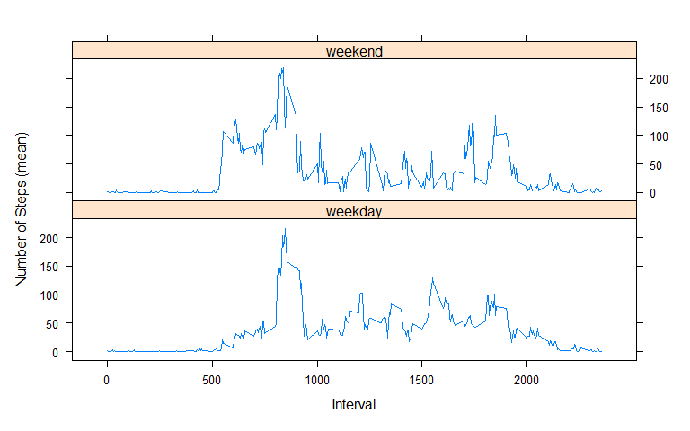

```r
knitr::opts_chunk$set(fig.width=8, fig.height=5, echo=TRUE, warning=FALSE) #global parameters
```
----

## <span style="color: blue;"> Data Preprocessing </span>

### *Load required packages*


```r
library(readr)
library(dplyr)
library(zoo)
```

### *Check the working directory*


```r
getwd()
```

```
## [1] "C:/Users/jeff/Documents/R/Repro_Research/RepData_PeerAssessment1"
```

### *Download and unzip the file*:
* Set the filename to match "activity.csv"
* Check to see if already downloaded and unzipped working directory (WD)
* If filename is missing, download to the WD from the given URL
* Unzip the air_pollution.zip into the WD
* activity.csv appears in the WD


```r
filename = "activity.csv"
if (!file.exists(filename)){
    urlzip <- "https://d396qusza40orc.cloudfront.net/repdata%2Fdata%2Factivity.zip"
    download.file(urlzip, destfile = "./activity.zip" )
    unzip("./activity.zip", exdir = getwd() )
}
```
----
## <span style="color: blue;">Loading and preprocessing the data</span>
* Set the path to match the working directory
* read filename that was unzipped above and indicate the header is present
* print the record of the activity file


```r
activity_main <- read.csv("./activity.csv", header = TRUE)
head(activity_main,5)
```

<div data-pagedtable="false">
  <script data-pagedtable-source type="application/json">
{"columns":[{"label":[""],"name":["_rn_"],"type":[""],"align":["left"]},{"label":["steps"],"name":[1],"type":["int"],"align":["right"]},{"label":["date"],"name":[2],"type":["chr"],"align":["left"]},{"label":["interval"],"name":[3],"type":["int"],"align":["right"]}],"data":[{"1":"NA","2":"2012-10-01","3":"0","_rn_":"1"},{"1":"NA","2":"2012-10-01","3":"5","_rn_":"2"},{"1":"NA","2":"2012-10-01","3":"10","_rn_":"3"},{"1":"NA","2":"2012-10-01","3":"15","_rn_":"4"},{"1":"NA","2":"2012-10-01","3":"20","_rn_":"5"}],"options":{"columns":{"min":{},"max":[10]},"rows":{"min":[10],"max":[10]},"pages":{}}}
  </script>
</div>

### *Make a Copy of Original Data*
It is always a good idea to not manipulate the original data file you upload (`activity_main`), so we make a copy:


```r
activity <- activity_main
```

### *Explore the Data*
* Note that there are numerous missing values (NAs) from the file printouts
* Since imputation will be dealt with more thoroughly later, let's exclude the missing values for now
* Calculate the mean and total number of steps


```r
activity <- activity_main[!is.na(activity[, 1]), ]
act_count <- count(activity[, 0])
act_mean <- mean(activity[, 1])
act_sum <- sum(activity[, 1])
cat("Mean number of steps =",act_mean)
```

```
## Mean number of steps = 37.3826
```

```r
cat("Total number of steps =",act_sum)
```

```
## Total number of steps = 570608
```

```r
act_count
```

<div data-pagedtable="false">
  <script data-pagedtable-source type="application/json">
{"columns":[{"label":["n"],"name":[1],"type":["int"],"align":["right"]}],"data":[{"1":"15264"}],"options":{"columns":{"min":{},"max":[10]},"rows":{"min":[10],"max":[10]},"pages":{}}}
  </script>
</div>

#### Let's also look at the following:
* dimension
* structure
* summary statistics


```r
dim(activity)      # Dimension
```

```
## [1] 15264     3
```

```r
str(activity)      # Structure
```

```
## 'data.frame':	15264 obs. of  3 variables:
##  $ steps   : int  0 0 0 0 0 0 0 0 0 0 ...
##  $ date    : chr  "2012-10-02" "2012-10-02" "2012-10-02" "2012-10-02" ...
##  $ interval: int  0 5 10 15 20 25 30 35 40 45 ...
```

```r
summary(activity)  # Summary
```

```
##      steps            date              interval     
##  Min.   :  0.00   Length:15264       Min.   :   0.0  
##  1st Qu.:  0.00   Class :character   1st Qu.: 588.8  
##  Median :  0.00   Mode  :character   Median :1177.5  
##  Mean   : 37.38                      Mean   :1177.5  
##  3rd Qu.: 12.00                      3rd Qu.:1766.2  
##  Max.   :806.00                      Max.   :2355.0
```
----
## <span style="color: blue;">Mean Total Number of Steps per Day</span>
Now let's answer the question, <span style="color: green;">**"What is mean total number of steps taken per day?"**</span>

First, let's calculate the total number of steps per day, which is different than the calculation for total number of steps we did previously. Also, we'll look ahead and note that we might want two options:
* one with missing values (our original `activity` data)
* one without missing values (`activity0`, the activity data exclusing NAs)
* note that there are several ways to exclude the NAs
  * using the `is.na()` function, which queries the data for NAs and record the value 'TRUE' if or each 'NA' found,
  * negating `is.na()`, i.e.`!is.na` (we'll use this here),
  * using 'na.rm', which is a logical value indicating whether 'NA' values should be stripped before the computation proceeds, and 
  * using the `complete.cases()` function (we'll use this later), which is used to return a logical vector with cases which are complete, i.e., no NAs.

Note that by applying a filter `!is.na` as a filter, we can turn it off by commenting it out


```r
steps_by_date <- select(activity, steps, date, interval) %>%
  filter(!is.na(steps)) %>% # removed filter to include NAs as 0-step days in histogram
  group_by(date) %>% 
  summarize(total_steps = sum(steps, na.rm = TRUE)) #has the same effect as `!is.na`
```

Second, using the total number of steps per day calculation, we can now compute the mean and median number of steps per day. Here, we assume that each date represents a day, and that there are mulutiple periods recored each day, i.e., the 5-minute intervals.

### *Mean-Median number of Steps per day*
Here, we use the complete.case() function as, previously mentioned to "remove" missing values


```r
steps_by_date <- activity[complete.cases(activity),] %>% 
  group_by(date) %>% 
  summarize(total_steps=sum(steps))
steps_by_date
```

<div data-pagedtable="false">
  <script data-pagedtable-source type="application/json">
{"columns":[{"label":["date"],"name":[1],"type":["chr"],"align":["left"]},{"label":["total_steps"],"name":[2],"type":["int"],"align":["right"]}],"data":[{"1":"2012-10-02","2":"126"},{"1":"2012-10-03","2":"11352"},{"1":"2012-10-04","2":"12116"},{"1":"2012-10-05","2":"13294"},{"1":"2012-10-06","2":"15420"},{"1":"2012-10-07","2":"11015"},{"1":"2012-10-09","2":"12811"},{"1":"2012-10-10","2":"9900"},{"1":"2012-10-11","2":"10304"},{"1":"2012-10-12","2":"17382"},{"1":"2012-10-13","2":"12426"},{"1":"2012-10-14","2":"15098"},{"1":"2012-10-15","2":"10139"},{"1":"2012-10-16","2":"15084"},{"1":"2012-10-17","2":"13452"},{"1":"2012-10-18","2":"10056"},{"1":"2012-10-19","2":"11829"},{"1":"2012-10-20","2":"10395"},{"1":"2012-10-21","2":"8821"},{"1":"2012-10-22","2":"13460"},{"1":"2012-10-23","2":"8918"},{"1":"2012-10-24","2":"8355"},{"1":"2012-10-25","2":"2492"},{"1":"2012-10-26","2":"6778"},{"1":"2012-10-27","2":"10119"},{"1":"2012-10-28","2":"11458"},{"1":"2012-10-29","2":"5018"},{"1":"2012-10-30","2":"9819"},{"1":"2012-10-31","2":"15414"},{"1":"2012-11-02","2":"10600"},{"1":"2012-11-03","2":"10571"},{"1":"2012-11-05","2":"10439"},{"1":"2012-11-06","2":"8334"},{"1":"2012-11-07","2":"12883"},{"1":"2012-11-08","2":"3219"},{"1":"2012-11-11","2":"12608"},{"1":"2012-11-12","2":"10765"},{"1":"2012-11-13","2":"7336"},{"1":"2012-11-15","2":"41"},{"1":"2012-11-16","2":"5441"},{"1":"2012-11-17","2":"14339"},{"1":"2012-11-18","2":"15110"},{"1":"2012-11-19","2":"8841"},{"1":"2012-11-20","2":"4472"},{"1":"2012-11-21","2":"12787"},{"1":"2012-11-22","2":"20427"},{"1":"2012-11-23","2":"21194"},{"1":"2012-11-24","2":"14478"},{"1":"2012-11-25","2":"11834"},{"1":"2012-11-26","2":"11162"},{"1":"2012-11-27","2":"13646"},{"1":"2012-11-28","2":"10183"},{"1":"2012-11-29","2":"7047"}],"options":{"columns":{"min":{},"max":[10]},"rows":{"min":[10],"max":[10]},"pages":{}}}
  </script>
</div>

### *Calculate Mean and Median Total Steps per Day*
Next, we calculate and report the mean and median of the total number of steps taken per day. We compute them using the mean() and median() functions and name the computation, `MeanMedian_Raw`, for the unimputed data, and `MeanMedian_Imputed` (used later). 


```r
MeanMedian_Raw <- 
  activity[complete.cases(activity),] %>% 
  group_by(date) %>% 
  summarize(average_steps=mean(steps),median_steps=median(steps)) %>%
as.data.frame(MeanMedian_Raw)

mean_total_steps <- mean(steps_by_date$total_steps)
median_total_steps <- median(steps_by_date$total_steps)
cat("The mean of the total number of steps taken per day is ", mean_total_steps)
```

```
## The mean of the total number of steps taken per day is  10766.19
```

```r
cat("The median of the total number of steps taken per day is ", median_total_steps)
```

```
## The median of the total number of steps taken per day is  10765
```
### *Plot the histogram*
Here, we use R's base function to plot a histogram of the total steps per day.
We also add aesthetics, including
* A plot title (main)
* x and y labels
* customer colors
* breaks, which is a single number, treated as a suggestion as it gives pretty breakpoints 

We also generate ablines using the `abline()` function, which can be used to add vertical, horizontal or regression lines to a graph. We add the vertical lines to the histogram we created earlier at the mean and median points. This also demonstrates how additional plotting objects can be added to an existing plot.

```r
hist(steps_by_date$total_steps, 
     main = "Histogram of total steps per day", 
     xlab = "Total steps per day", 
     ylab = "Frequency [number of days]", 
     breaks = 20,
     border = "slateblue4",
     col = "dodgerblue"
)
abline(v = mean_total_steps, lwd = 1, lty = 2, col = "red")
abline(v = median_total_steps, lwd = 1, lty = 2, col = "red")
```

<!-- -->
----
## <span style="color: blue;">Average Daily Activity Pattern</span>
Here, we answer the question, <span style="color: green;">**"What is the average daily activity pattern?"**</span> 

To do so, we create a quasi time-series plot (the plot is technical a scatterplot, as the activity data is not properly formatted with a time-based index, which we could do using the `xts`-package). However, we will apply a 100-interval moving average to investigate how we might impute missing values with a mean value, for example. 

### *Plot customization*
We'll also customize the plot with the following aethetics:
* A line type scatterplot using `type = "l"`
* a wider line width, using `lwd`
* a custom color, `royalblue4`, using `col`
* a plot title, using `main`
* x- and y-axis labels, with xlab and ylab, respectively
* the 100-period moving average line, and
* a customized legend

Finally, we will add vertical and horizontal lines, using abline(), representing the point where the maximum average steps occur.


```r
steps_by_interval <- select(activity, steps, date, interval) %>% 
  group_by(interval) %>% 
  summarize(average_steps = mean(steps, na.rm = TRUE))
dim0 <- dim(steps_by_interval)
cat("The dimension of steps_by_interval is: ", dim0)
```

```
## The dimension of steps_by_interval is:  288 2
```

<span style="color: green;"> Which 5-minute interval, on average across all the days in the dataset, contains the maximum number of steps?</span>


```r
x <- steps_by_interval[steps_by_interval$average_steps==max(steps_by_interval$average_steps),1]
cat("The 5-minute interval with the maximum steps is: ", as.character(x))        
```

```
## The 5-minute interval with the maximum steps is:  835
```

### *Time series plot*


```r
new_steps_100ma <- zoo::rollmean(activity["steps"], k = 100, fill = NA)
plot(steps_by_interval$interval, steps_by_interval$average_steps, 
     type = "l",
     lwd  = 3, 
     col  = 'royalblue4',
     main = 'Average Steps by 5-minute Interval', cex = .85,
     xlab = "Interval",
     ylab = "Average number of steps")
lines(new_steps_100ma, lwd = 4, col = 'red2')
legend('topright', deaths.xts,
       c('Steps', '100-period MA'),
       fill = c('blue2', 'red2', 'green2'), cex = .85,
       box.lty = 1)

max_average_steps <- max(steps_by_interval$average_steps)
max_average_steps_interval <- steps_by_interval[
  steps_by_interval$average_steps == max_average_steps,
]$interval
abline(v = max_average_steps_interval, lwd = 1, lty = 2, col = "red")
abline(h = max_average_steps, lwd = 1, lty = 2, col = "red")
```

<!-- -->

### *Sample of some averages in steps_by_interval*:
The moving average plot shows that there is an overall pattern to the daily total average steps, five or six periods. We can estimate this as 2000/5 = 500 periods. We might also consider the first 500 as a warmup period, to reach steady state in the 100-period MA, giving us points at 1000, 1500, 2000, and 2500


```r
steps_by_interval[steps_by_interval$interval %in% c(1000,1500,2000,2500),]
```

<div data-pagedtable="false">
  <script data-pagedtable-source type="application/json">
{"columns":[{"label":["interval"],"name":[1],"type":["int"],"align":["right"]},{"label":["average_steps"],"name":[2],"type":["dbl"],"align":["right"]}],"data":[{"1":"1000","2":"40.56604"},{"1":"1500","2":"30.01887"},{"1":"2000","2":"19.62264"}],"options":{"columns":{"min":{},"max":[10]},"rows":{"min":[10],"max":[10]},"pages":{}}}
  </script>
</div>

```r
head(activity[which(is.na(activity$steps) & activity$interval %in% c(1000,1500,2000,2500)),], n = 30)
```

<div data-pagedtable="false">
  <script data-pagedtable-source type="application/json">
{"columns":[{"label":["steps"],"name":[1],"type":["int"],"align":["right"]},{"label":["date"],"name":[2],"type":["chr"],"align":["left"]},{"label":["interval"],"name":[3],"type":["int"],"align":["right"]}],"data":[],"options":{"columns":{"min":{},"max":[10]},"rows":{"min":[10],"max":[10]},"pages":{}}}
  </script>
</div>
----
## <span style="color: blue;">Imputing Missing Values</span>
Here, we investigate the <span style="color: green;">**effect of imputing missing `steps` values**,</span>

Considering that steps are derived electronically, zeros are valid entries. Although the missing values, NAs, are curious, we will develop a strategy to impute them. Here, we can use the pattern we noted with the 100-period MA, in particular, (500, 1000, 1500, 2000, 2500), since zeros are valid.

### *Caclulate number of missing vales*
First, we calculate and report the total number of missing values, using the `is.na()` function.


```r
x<-sum(is.na(activity[, 1]))
cat("Number of rows with missing values =",as.character(x))
```

```
## Number of rows with missing values = 0
```

### *Replace missing step values*
Here, we use the `mean()` function for a given interval, which we calculated above, to replace missing steps values (NAs). The object, `steps_by_interval`, contains means of steps for each interval (see above).


```r
steps_by_interval[steps_by_interval$interval %in% c(500,1000,1500,2000),]
```

<div data-pagedtable="false">
  <script data-pagedtable-source type="application/json">
{"columns":[{"label":["interval"],"name":[1],"type":["int"],"align":["right"]},{"label":["average_steps"],"name":[2],"type":["dbl"],"align":["right"]}],"data":[{"1":"500","2":"0.00000"},{"1":"1000","2":"40.56604"},{"1":"1500","2":"30.01887"},{"1":"2000","2":"19.62264"}],"options":{"columns":{"min":{},"max":[10]},"rows":{"min":[10],"max":[10]},"pages":{}}}
  </script>
</div>

```r
steps_by_interval <- as.data.frame(steps_by_interval)
```

### *Create objject to hold imputed values*
Next, we create an object to hold activity and imputed activity.


```r
Imputed <- activity
```
### *Find and replace missing values*
Next, we find rows with missing (NA) data and replace them with the mean we calculate for the given for the intervals.


```r
for (i in 1:nrow(Imputed)) { 
  if (is.na(Imputed$steps[i])){
    n <- steps_by_date[steps_by_date$interval==Imputed$interval[i],average_steps]
                           Imputed$steps[i]<- as.integer(round(n))
                           }
}
```
### *Define comparison data*
Now, we are ready to compare the data we just imputed with the work accomplished earlier. We proceed as follows.
* Populate the Imputed object with NAs imputed
* Redefine the data with NAs present
* Redefine the data with NAs removed
* Generate histograms for each set of data


```r
steps_by_date_imp <- Imputed %>% 
  group_by(date) %>% 
  summarize(imp_total_steps=sum(steps))
  
steps_by_date_na <- select(activity_main, steps, date, interval) %>%
  #filter(!is.na(steps)) %>% # removed filter to include NAs as 0-step days in histogram
  group_by(date) %>% 
  summarize(total_steps = sum(steps, na.rm = TRUE)) #has the same effect as `!is.na`

steps_by_date <- select(activity, steps, date, interval) %>%
  filter(!is.na(steps)) %>% # removed filter to include NAs as 0-step days in histogram
  group_by(date) %>% 
  summarize(total_steps = sum(steps, na.rm = TRUE)) #has the same effect as `!is.na`

par(mfrow=c(1,3))

hist(steps_by_date_imp$imp_total_steps, 
     main = "Histogram of Inputed Total Steps per Day (Avg/Interval)", 
     xlab = "Total steps per day", 
     ylab = "Frequency [number of days]",
     cex.main = 1.1,
     cex.lab = 1.1,
     breaks = 20,
     border = "slateblue4",
     col = "slateblue3"
)
hist(steps_by_date$total_steps, 
     main = "Histogram of Imputed Total Steps per Day (NAs Removed)",
     xlab = "Total steps per day", 
     ylab = "Frequency [number of days]", 
     cex.main = 1.1,
     cex.lab = 1.1,
     breaks = 20,
     border = "cadetblue4",
     col = "cadetblue3"
)
hist(steps_by_date_na$total_steps, 
     main = "Histogram of Total Steps per Day", 
     xlab = "Total steps per day", 
     ylab = "Frequency [number of days]", 
     cex.main = 1.1,
     cex.lab = 1.1,
     breaks = 20,
     border = "dodgerblue4",
     col = "dodgerblue3"
)
```

<!-- -->
The first two histograms demonstrates the imputation and removal of the NAs present in the third histogram. Zeros are still present, since zero is a valid entry.

### *Calculate and Report the Mean and Median Total Steps per Day*
Now we answer the question,<span style="color: green;">**"Are there differences in activity patterns between weekdays and weekends?"**</span>


```r
MeanMedian_Imputed <- 
  Imputed %>% 
  group_by(date) %>% 
  summarize(average_steps=mean(steps),median_steps=median(steps))
MeanMedian_Imputed
```

<div data-pagedtable="false">
  <script data-pagedtable-source type="application/json">
{"columns":[{"label":["date"],"name":[1],"type":["chr"],"align":["left"]},{"label":["average_steps"],"name":[2],"type":["dbl"],"align":["right"]},{"label":["median_steps"],"name":[3],"type":["dbl"],"align":["right"]}],"data":[{"1":"2012-10-02","2":"0.4375000","3":"0"},{"1":"2012-10-03","2":"39.4166667","3":"0"},{"1":"2012-10-04","2":"42.0694444","3":"0"},{"1":"2012-10-05","2":"46.1597222","3":"0"},{"1":"2012-10-06","2":"53.5416667","3":"0"},{"1":"2012-10-07","2":"38.2465278","3":"0"},{"1":"2012-10-09","2":"44.4826389","3":"0"},{"1":"2012-10-10","2":"34.3750000","3":"0"},{"1":"2012-10-11","2":"35.7777778","3":"0"},{"1":"2012-10-12","2":"60.3541667","3":"0"},{"1":"2012-10-13","2":"43.1458333","3":"0"},{"1":"2012-10-14","2":"52.4236111","3":"0"},{"1":"2012-10-15","2":"35.2048611","3":"0"},{"1":"2012-10-16","2":"52.3750000","3":"0"},{"1":"2012-10-17","2":"46.7083333","3":"0"},{"1":"2012-10-18","2":"34.9166667","3":"0"},{"1":"2012-10-19","2":"41.0729167","3":"0"},{"1":"2012-10-20","2":"36.0937500","3":"0"},{"1":"2012-10-21","2":"30.6284722","3":"0"},{"1":"2012-10-22","2":"46.7361111","3":"0"},{"1":"2012-10-23","2":"30.9652778","3":"0"},{"1":"2012-10-24","2":"29.0104167","3":"0"},{"1":"2012-10-25","2":"8.6527778","3":"0"},{"1":"2012-10-26","2":"23.5347222","3":"0"},{"1":"2012-10-27","2":"35.1354167","3":"0"},{"1":"2012-10-28","2":"39.7847222","3":"0"},{"1":"2012-10-29","2":"17.4236111","3":"0"},{"1":"2012-10-30","2":"34.0937500","3":"0"},{"1":"2012-10-31","2":"53.5208333","3":"0"},{"1":"2012-11-02","2":"36.8055556","3":"0"},{"1":"2012-11-03","2":"36.7048611","3":"0"},{"1":"2012-11-05","2":"36.2465278","3":"0"},{"1":"2012-11-06","2":"28.9375000","3":"0"},{"1":"2012-11-07","2":"44.7326389","3":"0"},{"1":"2012-11-08","2":"11.1770833","3":"0"},{"1":"2012-11-11","2":"43.7777778","3":"0"},{"1":"2012-11-12","2":"37.3784722","3":"0"},{"1":"2012-11-13","2":"25.4722222","3":"0"},{"1":"2012-11-15","2":"0.1423611","3":"0"},{"1":"2012-11-16","2":"18.8923611","3":"0"},{"1":"2012-11-17","2":"49.7881944","3":"0"},{"1":"2012-11-18","2":"52.4652778","3":"0"},{"1":"2012-11-19","2":"30.6979167","3":"0"},{"1":"2012-11-20","2":"15.5277778","3":"0"},{"1":"2012-11-21","2":"44.3993056","3":"0"},{"1":"2012-11-22","2":"70.9270833","3":"0"},{"1":"2012-11-23","2":"73.5902778","3":"0"},{"1":"2012-11-24","2":"50.2708333","3":"0"},{"1":"2012-11-25","2":"41.0902778","3":"0"},{"1":"2012-11-26","2":"38.7569444","3":"0"},{"1":"2012-11-27","2":"47.3819444","3":"0"},{"1":"2012-11-28","2":"35.3576389","3":"0"},{"1":"2012-11-29","2":"24.4687500","3":"0"}],"options":{"columns":{"min":{},"max":[10]},"rows":{"min":[10],"max":[10]},"pages":{}}}
  </script>
</div>

#### *Do these values differ from the estimates from the first part of the assignment?*
There is no significant difference


```r
summary(MeanMedian_Raw,2:3)
```

```
##      date           average_steps      median_steps
##  Length:53          Min.   : 0.1424   Min.   :0    
##  Class :character   1st Qu.:30.6979   1st Qu.:0    
##  Mode  :character   Median :37.3785   Median :0    
##                     Mean   :37.3826   Mean   :0    
##                     3rd Qu.:46.1597   3rd Qu.:0    
##                     Max.   :73.5903   Max.   :0
```

```r
summary(MeanMedian_Imputed,2:3)
```

```
##      date           average_steps      median_steps
##  Length:53          Min.   : 0.1424   Min.   :0    
##  Class :character   1st Qu.:30.6979   1st Qu.:0    
##  Mode  :character   Median :37.3785   Median :0    
##                     Mean   :37.3826   Mean   :0    
##                     3rd Qu.:46.1597   3rd Qu.:0    
##                     Max.   :73.5903   Max.   :0
```
----
## <span style="color: blue;">Weekend and Weekday Activity Patterns</span>
Now, we answer the question, <span style="color: green;">"Are there differences in activity patterns between weekdays and weekends?"</span>
  
For this part the weekdays() function may be of some help here. Use the dataset with the filled-in missing values for this part. Create a new factor variable in the dataset with two levels - "weekday" and "weekend" indicating whether a given date is a weekday or weekend day.

### *Create the names*
First, we define the names of the days in a week and corresponding descriptors, weekday and weekend. We also attend to the necessary data imputations along the line of our previous work.


```r
DayOfWeek <- data.frame(
  name=c("Monday","Tuesday","Wednesday","Thursday","Friday","Saturday","Sunday"),
  part=c("weekday","weekday","weekday","weekday","weekday","weekend","weekend"))

Imputed$date<-as.Date(Imputed$date)

## Create the column
Imputed$WeekPart <- as.factor(weekdays(Imputed$date))
## Set the value
Imputed$WeekPart <- DayOfWeek[Imputed$WeekPart,2]
```
### *Make a panel plot *
We also make a panel plot containing a time series plot (i.e. type = "l") of the 5-minute interval (x-axis) and the average number of steps taken, averaged across all weekday days or weekend days (y-axis). To do this, we:
* Calculate and store the means by group
* Construct a lattice plot for weekend and weekdays


```r
PlotSummary <- Imputed %>% 
  group_by(WeekPart,interval) %>% 
  summarize(StepsMean=mean(steps))
```

```
## `summarise()` has grouped output by 'WeekPart'. You can override using the `.groups` argument.
```

```r
## Use the lattice graphics for easier multiple panels
library(lattice)
xyplot(PlotSummary$StepsMean ~ PlotSummary$interval | PlotSummary$WeekPart, 
       data=PlotSummary, type="l", layout=c(1:2),
       ylab="Number of Steps (mean)",
       xlab="Interval")
```

<!-- -->

Examination of the two plots indicate that the weekday and weekend activity is roughly the same over the same time intervals.
